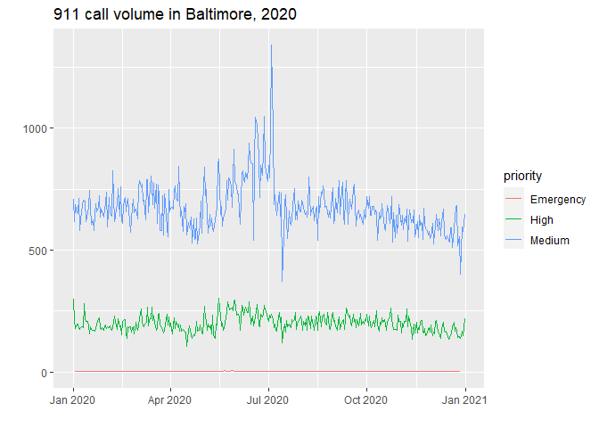

```r
library(tidyverse) # data validation, piping, etc.
library(lubridate) # dates
library(ggplot2) # plots
library(sf) # maps
library(ggthemes) # also maps
```

# Loading the data

source: https://bmore-open-data-baltimore.hub.arcgis.com/datasets/911-calls-for-service-2020


```r
# reading in data
calls <- read.csv("911_Calls_For_Service_2020.csv")
```


# Cleaning the data

```r
# cleaning data
# create column for yyyy/mm/dd
calls<- calls %>% 
  mutate(call_date = ymd(
    paste(year(callDateTime),                     
          month(callDateTime),
          day(callDateTime)))) %>%
    mutate(call_hour = hour(callDateTime))
```


# Plotting calls over time

```r
calls %>%
  group_by(call_date) %>%
  count(call_date,sort=TRUE) %>%
  ggplot(aes(call_date,n)) +
  geom_line()+
  labs(x="",
       y="",
       title="911 call volume in Baltimore, 2020")+
  expand_limits(y=0)
```

<!-- -->

```r
calls %>%
  filter(priority != "Non-Emergency", 
         priority !="",
         priority !="Low",
         priority !="Out of Service") %>%
  group_by(call_date, priority,) %>%
  count(call_date,sort=TRUE) %>%
  ggplot(aes(call_date,n, color=priority)) +
  geom_line()+
  labs(x="",
       y="",
       title="911 call volume in Baltimore, 2020")+
  expand_limits(y=0)
```

<!-- -->

# Where do the most calls occur?


```r
calls %>% 
  count(Community_Statistical_Areas,sort=FALSE) %>%
  mutate(Community_Statistical_Areas = fct_reorder(Community_Statistical_Areas,n)) %>%
  head(20) %>%
  ggplot(aes(n,Community_Statistical_Areas)) +
  geom_col() +
  labs(x="number of 911 calls",
       y="",
       title = "911 calls in Baltimore City 2020")
```

<!-- -->


```r
calls %>%
  filter(PoliceDistrict!="",
         priority !="",
         priority !="Non-Emergency",
         priority !="Low") %>%
  group_by(call_date,PoliceDistrict) %>%
  count(call_date,sort=TRUE) %>%
  ggplot(aes(call_date,n, color=PoliceDistrict))+
  geom_line()+
  facet_wrap(.~PoliceDistrict)+
  labs(x="",
       y="",
       title="911 calls in Baltimore 2020 by Police District")
```

<!-- -->


```r
calls %>%
  group_by(call_hour) %>%
  count(call_hour,PoliceDistrict) %>%
  ggplot(aes(call_hour,n, fill=PoliceDistrict)) +
  geom_col()+
  labs(x="hour",
       y="",
       title="911 calls volume in Baltimore by police district")
```

<!-- -->

# Exploring call descriptions

coming next...

(Why isn't `fct_reorde()` working?)


```r
calls %>%
  filter(priority==c("High","Medium")) %>% 
  count(description,priority, sort=FALSE)%>% 
  mutate(description,fct_reorder(description,n))%>%
  filter(n>1000) %>%
  ggplot(aes(n,description,fill=priority)) +
  geom_col()
```

<!-- -->

Trying to extract the hour and minute from `callDateTime` for more detailed time plots. (I may just give up and accept being able to extract the hour. Thank you David Robinson `@drobs` for your help with `strftime()`.)


```r
t<- head(calls$callDateTime,1000) %>%
  strftime("%H:%M") 
head(t)
```

```
## [1] "08:10" "09:16" "09:36" "09:17" "09:26" "09:40"
```

